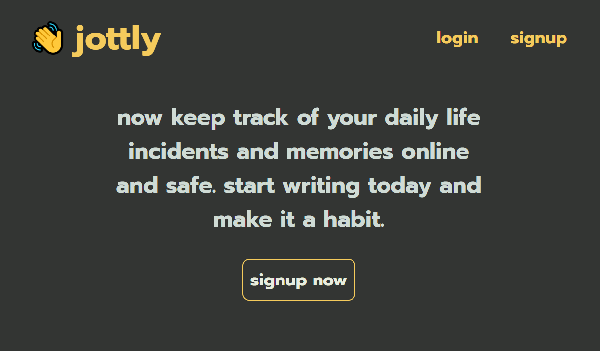
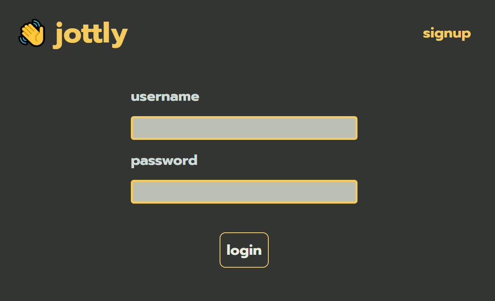

<h1 align="center">👋 jottly</h1>

> A simple note-taking app. (basically another diary app.. but maybe kinda neat ?)

## made with fresh ingredients :

- [x] css
- [x] html
- [x] js
- [x] nodejs

simple enough right? (_yes_)

## preview

## setup locally

- create a `.env` file in the `src` directory.
- set a desirable 4 digit port.
- get a mongodb-uri and create a new jwt secret.
- assign them under `MONGODB_URI` and `JWT_SECRET` in the same `.env` file.
- at this point i assume that you have nodejs so hit up the terminal and start the project using npm start.
- visit the project at https://localhost:`PORT`/

made with 💖 by [amazinglySK](https://github.com/amazinglySK)
